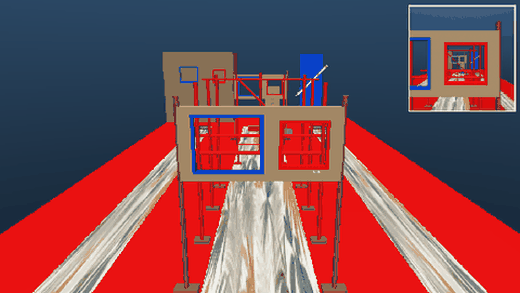
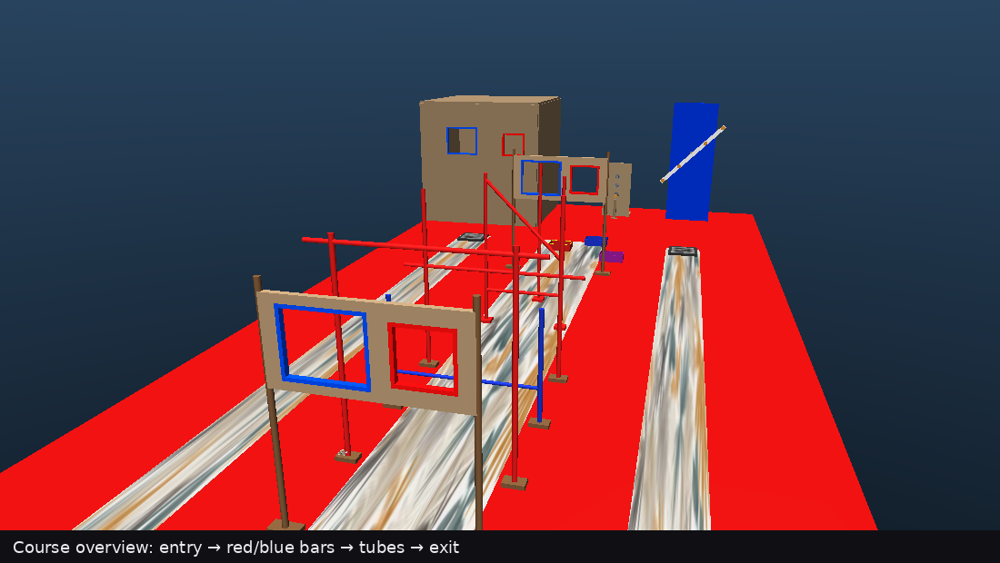
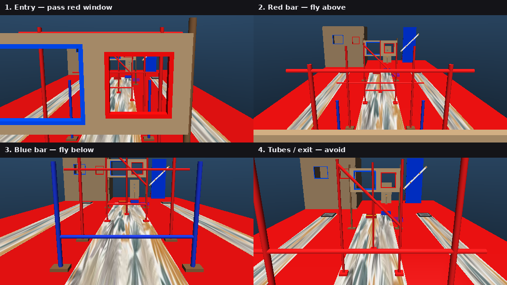
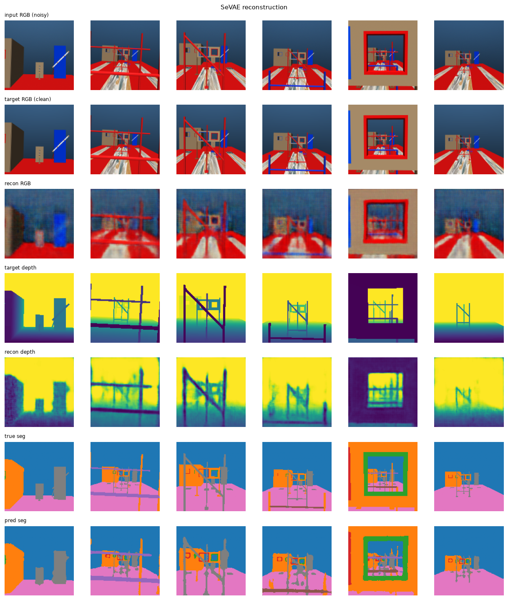
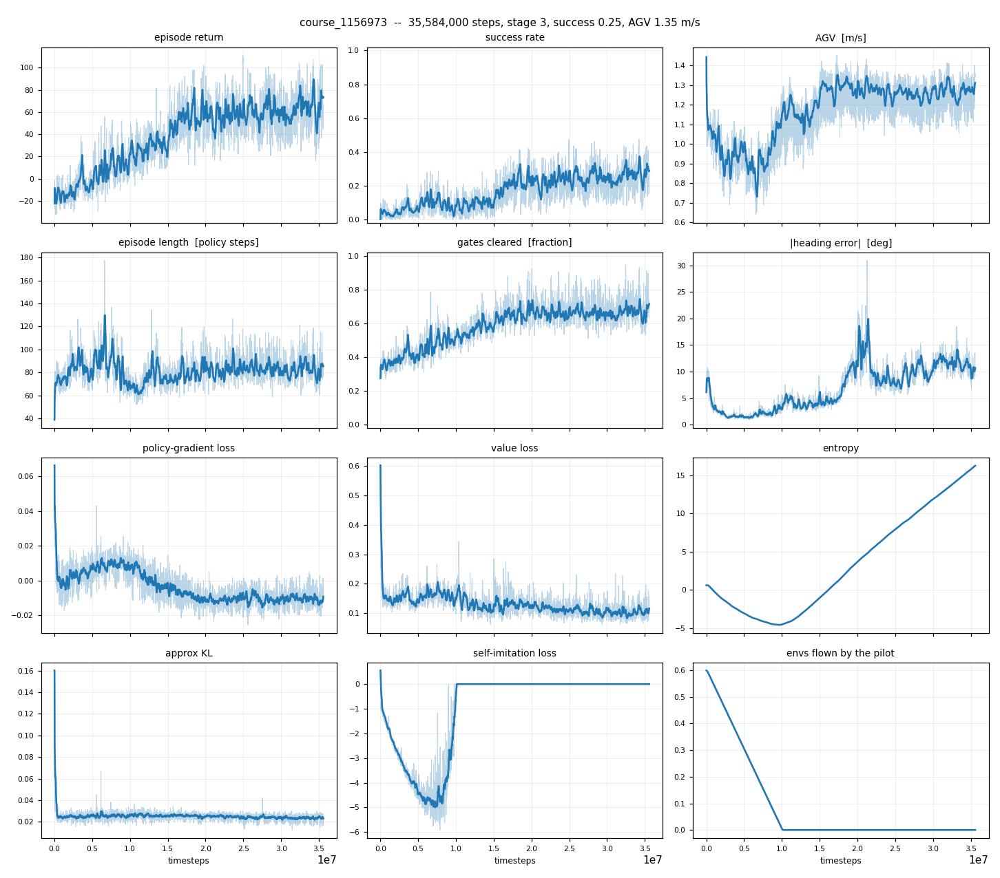

# Vision-Only Quadrotor Flight Through a Colour-Conditioned Obstacle Course

A memory-augmented reinforcement learning stack for flying a Crazyflie-class
quadrotor through a multi-station indoor obstacle course from onboard RGB-D
alone. The observation carries no gate poses, waypoints, or other privileged
geometry: the drone has to read the course from the camera and retain what it
saw once that geometry leaves the field of view.

**Status: training has not converged.** The encoder and memory stages are
trained and behave as intended; the policy currently clears the full three-bar
course about 30% of the time. See [Results](#results) for the numbers and the
known cause.

Demo (third-person view; top-right inset is the onboard RGB the encoder
receives). This is a successful episode -- at present roughly one run in three:

The stack follows [MAVRL](https://github.com/tudelft/mavrl) (Yu et al., IEEE
RA-L 2025) in spirit (latent encoder, memory, then policy), but the task and
several design choices differ as described below. For installation and how to
run every script, see [`mavrl/README.md`](mavrl/README.md).

## Environment

The arena is a corridor. The drone spawns behind an entry wall, flies through
zero to three bar stations, passes fixed obstacles (tubes, boxes, a turbine)
that score nothing but must not be hit, and leaves through an exit wall.

The scored gates are colour-conditioned. At the entry and exit walls the red
opening is the legal path and the blue opening is a decoy of similar size. At
each bar station a horizontal bar between two posts is either red or blue: red
means pass above the bar, blue means pass below it.

Bar heights are redrawn every episode from a discrete set per colour. Two of
those heights are held out of policy training so evaluation can ask whether the
agent learned the colour rule or memorised the altitudes it saw.

Memory is required because the onboard camera is fixed and forward-facing.
After a descent under a low blue bar, the next high red bar often sits outside
the vertical field of view; the final approach is flown on information from
earlier frames, not on what is currently visible.

Each observation is a 128x128 RGB-D image plus a 16-D proprioceptive vector
(body-frame gravity direction, gyro, body velocity, velocity-command state, and
previous action). The action is body-frame acceleration (3) plus a yaw rate
(1). The policy runs at 10 Hz over a 60 Hz PID loop on 240 Hz physics.

## Method

### Semantic VAE

A six-convolution encoder maps each RGB-D frame to a 64-D latent. Three decoder
heads reconstruct RGB, depth, and a semantic segmentation map. The
reconstruction loss is proximity-weighted so near geometry (what the drone can
hit) dominates capacity. The segmentation head is what keeps red and blue
separable in the latent; without it, an unsupervised reconstruction loss has
little reason to preserve the colour that defines the legal path.

The figure shows noisy RGB as the encoder receives it, clean RGB, the
reconstruction, then depth and segmentation targets against predictions.

### Temporal attention with four memory tokens

The deployed memory is windowed temporal attention with four recurrent memory
tokens (RMT-style; cf. Bulatov et al., 2022). During memory training an
auxiliary head must reconstruct the image from about two seconds earlier as
well as the current one. The attention window is shorter than that offset, so
the past frame is not sitting in the buffer and must be carried in the tokens.

Both reconstructions are decoded from the same latent at time t. The top pair
is the frame from twenty policy steps ago; the bottom pair is the current
frame. When the current view no longer contains the red bar, the past
reconstruction still places it: that content is coming from memory, not from
the input.

### Policy

An actor-critic reads the memory state concatenated with proprioception and
outputs the acceleration and yaw command. Training warm-starts from behaviour
cloning on scripted (or optional teleop) demos, then continues with recurrent
PPO. A decaying fraction of environments can also be flown by the scripted
pilot under a self-imitation learning (SIL) objective, so good expert
transitions reinforce the policy without staying on forever. The course
curriculum grows from entry-to-exit only up to the full three-bar course.

## Results

Reported from the longest PPO run to date: 35.7M environment steps at stage 3
(the full three-bar course), attention memory with four tokens, warm-started
from behaviour cloning with a decaying scripted-pilot mix.

| Metric | Value |
|---|---|
| Success (all gates cleared) | 0.29 |
| Mean gates cleared | 0.67 of the course |
| Dominant failures | collision (~38% of episodes), wrong side of a bar (~20%) |

The full log is in [`results/`](results/) -- one JSON object per rollout, so
every number above is checkable -- alongside the SeVAE, memory and policy
weights.

Two caveats, both load-bearing.

**This is measured on the training height split.** The held-out-height
evaluation that `evaluate.py` implements -- the test of whether the policy
learned "red means above" or memorised four bar heights -- has not been run on a
converged model, so no generalization number is claimed here.

**The run is not clean.** Policy entropy climbs monotonically from -4.4 to
+16.4 across the run, which for a 4-D diagonal Gaussian is a standard deviation
around 14 against an action space clipped to +/-1. The entropy bonus is buying
entropy in a region the environment cannot observe, so the sampled policy over
the later half of the run is close to bang-bang. The fix is a squashed (tanh)
Gaussian with the log-determinant correction, or a bounded `log_std`; until that
lands, the number above is a floor from a misbehaving run rather than the
method's ceiling.

Built but unrun: the memory ablation (`--memory-type` over none / LSTM /
attention, `--mem-tokens` for the token count), the depth-only-vs-SeVAE
comparison, and multi-seed evaluation with confidence intervals.

## Relation to MAVRL

MAVRL demonstrated memory-augmented latent flight in unstructured clutter from
depth. This project keeps that overall recipe and changes the parts the colour
course requires.

The task is a structured arena with an explicit colour rule rather than random
obstacles, so the encoder takes RGB-D instead of depth alone and adds a
segmentation head with proximity-weighted reconstruction (SeVAE). Memory is
temporal attention with four recurrent tokens rather than an LSTM (LSTM remains
as an ablation). Speed variation appears through curriculum and progress /
overspeed shaping on a fixed corridor instead of MAVRL's explicit
varying-speed objective. Data for the encoder and warm-start come from a
scripted pilot (and optional teleop), with an optional pilot mix inside PPO,
rather than from online policy rollouts alone. Simulation is the MuJoCo
Crazyflie stack in `multi_drone_mujoco`.

The point of the adaptation is rule-conditioned flight: colour, not geometry
alone, decides the legal path, and bars often leave the camera before the
commitment is finished.

## Code layout

`mavrl/course_world.py`, `course_gates.py`, and `course_aviary.py` define the
arena, gate logic, and Gymnasium environment. `sevae.py`, `memory.py`,
`policy.py`, and `ppo.py` are the encoder, memory backbones, actor-critic, and
recurrent PPO. `collect.py`, `teleop.py`, and `bc.py` build data and warm-start
weights. `train_sevae.py`, `train_memory.py`, and `train_course.py` are the
training stages. `evaluate.py` and `preview.py` evaluate the policy and render the
arena.

Install and run instructions live in [`mavrl/README.md`](mavrl/README.md).

## Training compute

Policy training ran on ParamShakti (IIT Kharagpur HPC) with EGL headless
rendering. Parallel environments share GL contexts across render workers so
VRAM scales with the number of contexts rather than the number of envs.

## References

- Yu, Ferranti, et al. *MAVRL: Learn to Fly in Cluttered Environments with
  Varying Speed.* IEEE RA-L 2025. https://github.com/tudelft/mavrl
- Bulatov, Kuratov, Burtsev. *Recurrent Memory Transformer.* NeurIPS 2022.
- Tayal. *MuJoCo-Drones-Gym.* arXiv:2606.08039, 2026.
  https://arxiv.org/abs/2606.08039
- MuJoCo Menagerie, Bitcraze Crazyflie 2.x MJCF model.

## License

MIT
